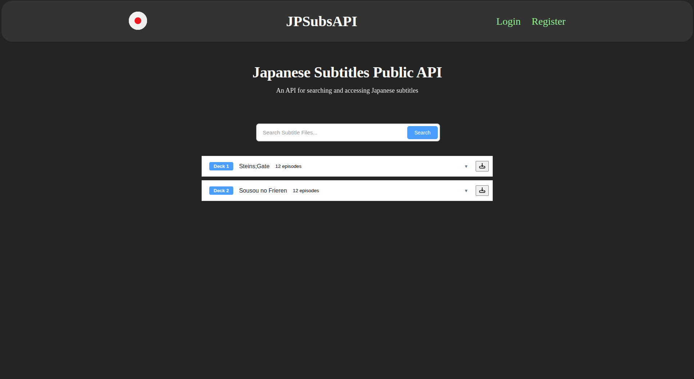

# Japanese Subtitles API

I had initially intended for this to be a public API from which you could extract Japanese subtitles as I noticed it did not exist.

However, after building it to a point where I could actually reasonably add, download and make specific api reqests with metadata,
I realised that the reason it doesn't exist is that almost all Japanese subtitles are copyrighted and as such cannot be made
available for download through API or through direct download from the website.

As a result I stopped working on this project, however I could perhaps make it into something new in the future.

It was still valuable as I learned a lot of go fundamentals and can comfortably write REST API endpoints in go and set up 
the entire backend, database and server in GO. 

I also learned some fundamentals of typescript as I had not used it before. Largely however the frontend is quite simplistic.

Here is an image of how the site looked or I intended for it to look:

## Home Page

There was another page where I could add subtitles and specify metadata but, visually it was quite elementary.

Thanks for reading :)
